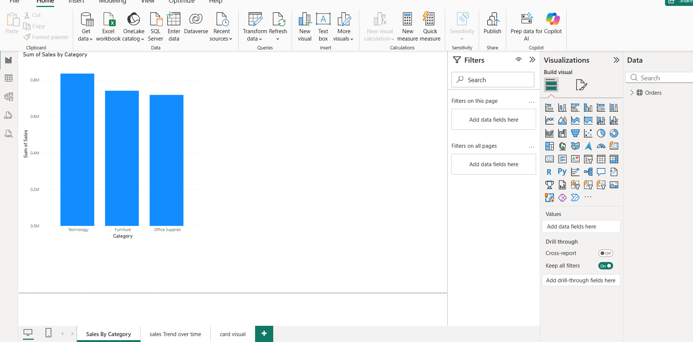
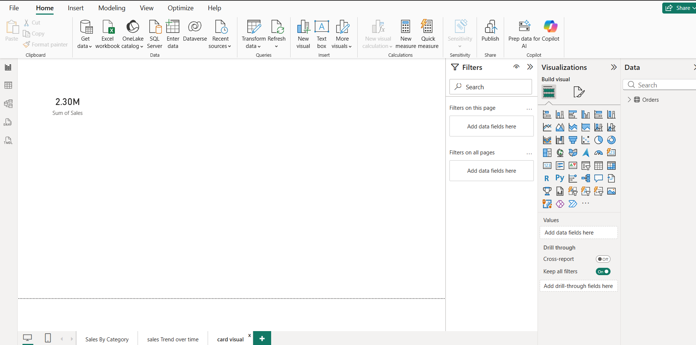

# Retail Sales Performance Analysis (Power BI)

## Project Overview 
This project analyzes retail sales data to identify key business insights such as top-performing product categories and sales trend overtime.

## Tools Used 
- Excel
- Power BI

## Dataset 
Sample Superstone dataset (public datasetcommonly used for analytics practice).

## Key Insights 
Technology category generated the highest sales.
Total sales reached approximately $2.30M.
Sales trends fluctuate across months with several peak sales periods.

## Dashboard components
- Sales By Category (Bar Chart)
- Sales Trend Over Time (Line Chart)
- Total Sales KPI Card

## Objective 
To demonstrate skills in data exploration, business insights, and dashboard creation using Power BI.

## Dashboard Preview
### Sales By Category

### Sales Trend Over Time
! [Sales Trend](sales_trend.png)

### Total Sales KPI

